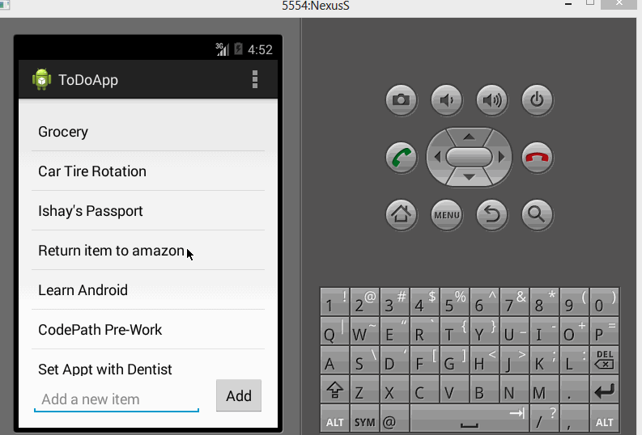

# Simple ToDo List Android Application Demo

This is an Android demo application for maintaining a to-do list for any android phone user.

Time spent: 2-3 hours spent so far

Completed user stories:

* [x] Required: Users can view their current to-do list items
* [x] Required: Users can click on Add button to add an item to the list
* [x] Required: Users can click on an item in the list to open the edit item window
* [x] Required: Users can long click on an item in the list to remove the item from the list
 
Walkthrough of all user stories:

GIF created with [LiceCap](http://www.cockos.com/licecap/).
